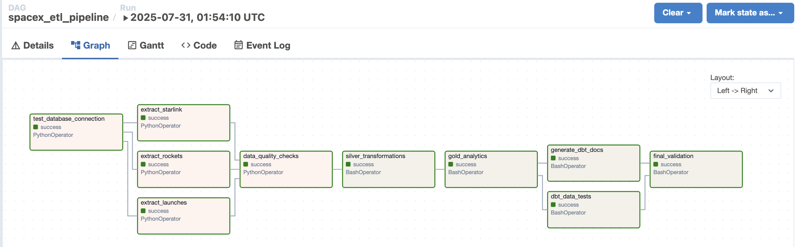

# Implementation Details

## Executive Summary

**Business Question**: "When will there be 42,000 Starlink satellites in orbit, and how many launches will it take to reach that number?"

**Answer**: Based on historical performance (2018-2022), SpaceX needs approximately **656 additional launches** over **507.9 months** (~42 years) to reach 42,000 satellites, with an estimated completion date of **November 27, 2067**.

---

## How to Execute the Pipeline

### Prerequisites
- Docker & Docker Compose
- Astro CLI installed - [Installation Guide](https://docs.astronomer.io/astro/cli/install-cli)
- 8GB+ RAM recommended

### Step-by-Step Execution

```bash
# 1. Clone the repository
git clone [airflow-localdev](https://github.com/Weixin97/airflow-localdev.git)
cd astro

# 2. Start the Airflow environment
astro dev start

# 3. Access Airflow UI
# Navigate to http://localhost:8080
# Login: admin/admin

# 4. Enable and trigger the DAG
# - Find 'spacex_etl_pipeline' DAG
# - Toggle it ON
# - Click "Trigger DAG" button

# 5. Monitor execution (takes ~2-5 minutes)
# Watch tasks progress: Extract → Transform → Load → Analytics

# 6. View results 
# - execute the below command in terminal
docker exec -it spacex_postgres psql -U spacex_user -d spacex_db #password: spacex_password

SELECT * FROM gold.starlink_42k_projection;

```

### Expected Results
The pipeline will extract ~3,268 active satellites and ~205 launches, then provide business projections in the gold layer materialized view.



---

## Pipeline Architecture Design Decisions


### Medallion Architecture Choice
Implemented a **Bronze → Silver → Gold** medallion architecture because:

- **Bronze Layer**: Raw JSON storage preserves original API data for auditability
- **Silver Layer**: Cleaned, parsed data with business logic (Starlink mission identification)
- **Gold Layer**: Analytics-ready tables answering specific business questions
- **Scalability**: Each layer can be optimized independently
- **Data Quality**: Clear separation of concerns with validation at each stage

### Technology Stack Rationale

**Airflow + dbt Combination**:
- **Airflow**: Good for orchestration, API extraction, and complex workflows
- **dbt**: Superior for SQL transformations, testing, and documentation
- **PostgreSQL**: Robust JSONB support for semi-structured SpaceX API data
- **Docker**: Ensures reproducible environments across development/production

### Data Storage Strategy

**PostgreSQL with JSONB**:
- **Raw JSON Storage**: Preserves complete API responses without schema assumptions
- **Flexible Querying**: JSONB allows complex nested data extraction
- **Performance**: Indexed JSON fields for faster satellite status queries
- **Future-Proof**: Can handle API schema changes without pipeline breaks

---

## Key Technical Decisions

### 1. No Pandas Dependency
- **Decision**: Used pure Python + psycopg2 instead of Pandas
- **Rationale**: Reduced memory footprint, faster container startup, fewer dependencies
- **Trade-off**: More manual data manipulation code vs. Pandas convenience

### 2. Real-time API Extraction
- **Decision**: Extract directly from live SpaceX API vs. static datasets
- **Rationale**: Demonstrates real ETL capabilities, handles API rate limits
- **Challenge**: API data only goes to 2022, affecting "recent" calculations

### 3. Schema Design
- **Decision**: Clean, business-friendly column names in gold layer
- **Rationale**: Analyst-ready outputs, no technical jargon in business tables

### 4. Error Handling
- **Decision**: PostgreSQL type casting and data quality checks throughout
- **Rationale**: Production-ready pipeline with clear failure points
- **Implementation**: Pipeline metadata logging, retry mechanisms, data validation

---

## Challenges & Solutions
### Challenge 1: Historical Data Limitations
**Problem**: SpaceX API data ends in 2022, making "recent activity" calculations impossible

**Solution**: 
- Used dynamic time windows based on available data
- Implemented multiple projection scenarios (conservative, current pace, optimistic)
- Added confidence indicators based on data availability

---

## Data Quality & Validation

### Implemented Quality Checks
- **Data Freshness**: Monitoring extraction timestamps
- **Completeness**: Counting records at each pipeline stage
- **Accuracy**: Validating satellite active/inactive status logic
- **Consistency**: Cross-referencing launch data with satellite deployment

### Business Logic Validation
- **Satellite Count**: 3,268 active satellites (reasonable for 2022 data)
- **Launch Success Rate**: 95.4% (62/65 successful Starlink launches)
- **Mission Identification**: 65 Starlink missions identified from launch data
---

## What Would I Improve with More Time?

### 1. Advanced Analytics
- **Orbital Analysis**: Satellite constellation coverage maps
- **Failure Analysis**: Detailed satellite deorbit/failure tracking
- **Cost Modeling**: Launch cost projections based on reusability metrics

### 2. Real-time Capabilities
- **Streaming**: Kafka + Spark for real-time satellite tracking
- **Alerting**: Slack/email/Teams notifications for failure/anomalies

### 3. Production Readiness
- **Kubernetes Deployment**: Scalable container orchestration
- **CI/CD Pipeline**: Automated testing and deployment
- **Monitoring**: Grafana dashboards, Prometheus metrics
- **Data Lineage**: Complete end-to-end tracking

---

## 💭 Final Thoughts

This project demonstrates a **complete end-to-end data engineering solution** that transforms raw API data into actionable business intelligence. The choice of medallion architecture, combined with modern tools like Airflow and dbt, creates a robust foundation for satellite constellation analytics.
